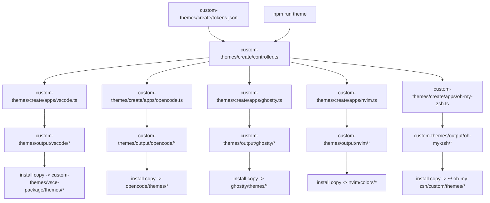

# Theme Generation Diagram

```mermaid
flowchart TD
  A["custom-themes/create/tokens.json"] --> B["custom-themes/create/controller.ts"]
  B --> C["custom-themes/create/apps/vscode.ts"]
  B --> D["custom-themes/create/apps/opencode.ts"]
  B --> E["custom-themes/create/apps/ghostty.ts"]
  B --> F["custom-themes/create/apps/nvim.ts"]
  B --> G["custom-themes/create/apps/oh-my-zsh.ts"]

  C --> H["custom-themes/output/vscode/*"]
  D --> I["custom-themes/output/opencode/*"]
  E --> J["custom-themes/output/ghostty/*"]
  F --> K["custom-themes/output/nvim/*"]
  G --> L["custom-themes/output/oh-my-zsh/*"]

  H --> M["install copy -> custom-themes/vsce-package/themes/*"]
  I --> N["install copy -> opencode/themes/*"]
  J --> O["install copy -> ghostty/themes/*"]
  K --> P["install copy -> nvim/colors/*"]
  L --> Q["install copy -> ~/.oh-my-zsh/custom/themes/*"]

  R["npm run theme"] --> B
```
